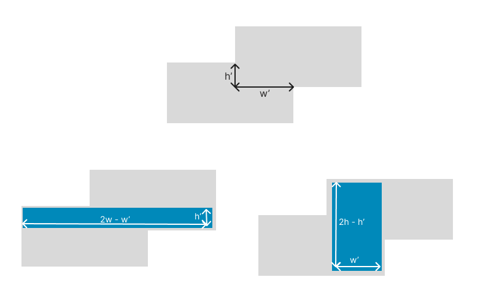

# Tarea Dev Junior - Ruuf

## 🎯 Objetivo

El objetivo de este ejercicio es poder entender tus habilidades como programador/a, la forma en que planteas un problema, cómo los resuelves y finalmente cómo comunicas tu forma de razonar y resultados.

## 🛠️ Problema

El problema a resolver consiste en encontrar la máxima cantidad de rectángulos de dimensiones "a" y "b" (paneles solares) que caben dentro de un rectángulo de dimensiones "x" e "y" (techo).

## 🚀 Cómo Empezar

### Opción 1: Solución en TypeScript
```bash
cd typescript
npm install
npm start
```

### Opción 2: Solución en Python
```bash
cd python
python3 main.py
```

## ✅ Casos de Prueba

Tu solución debe pasar los siguientes casos de prueba:
- Paneles 1x2 y techo 2x4 ⇒ Caben 4
- Paneles 1x2 y techo 3x5 ⇒ Caben 7
- Paneles 2x2 y techo 1x10 ⇒ Caben 0

---

## 📝 Tu Solución

Deja acá el link a tu video explicando tu solución con tus palabras:

https://youtu.be/G1Xi4b6AQmk

---

## 💰 Bonus (Opcional)

Si completaste alguno de los ejercicios bonus, explica tu solución aquí:

### Bonus Implementado
Rectángulos iguales superpuestos:

```python
def calculate_panels_with_overlap(panel_width: int, panel_height: int, 
                                  roof_width: int, roof_height: int,
                                  overlap_width: int, overlap_height) -> int:
    
    panel_width, panel_height = sorted((panel_width, panel_height))

    roof_width, roof_height = sorted((roof_width, roof_height))

    if panel_width <= roof_width and panel_height <= roof_height:
      panel_area = panel_width * panel_height
      overlap_area = overlap_width * overlap_height

      roof_area = 2 * roof_width * roof_height - overlap_area

      return roof_area // panel_area
    else:
      return max(
        calculate_panels(panel_width, panel_height,
                          2*roof_width-overlap_width, overlap_height),
        calculate_panels(panel_width, panel_height,
                          overlap_width, 2*roof_height-overlap_height),
      )
    # ejemplo donde el panel cabe en uno de los dos rectángulos:
    assert calculate_panels_with_overlap(1, 2, 2, 4, 1, 2) == 7
    # ejemplo donde no cabe:
    assert calculate_panels_with_overlap(1, 5, 3, 4, 2, 2) == 2
```

### Explicación del Bonus

La idea es la siguiente. Primero se verifica que por lo menos un panel cabe dentro de uno de los dos rectángulos, usando la misma condición que en el problema normal: que el lado más largo del panel sea más corto que el lado más largo del rectángulo y que el lado más corto del panel sea más corto que el lado más corto del rectángulo. Si esta condición se cumple se calcula la cantidad de veces que cabe el panel en el techo simplemente dividiendo el área del techo por el área del panel redondeando hacia abajo, igual que en el caso anterior. La diferencia es que en este caso el área del techo es ```2 * roof_width * roof_height - overlap_area``` en lugar de solo ```roof_width * roof_height```.

Ahora nos quedan los casos en el que el panel no cabe en uno de los rectángulos pero si cabe en una de las dos áreas que se producen al unir los dos rectángulos. No sé como explicar esto con palabras así que pondré un dibujo de estas dos áreas:



Lo que se hace entonces es calcular la cantidad de paneles que caben en estas dos áreas y quedarse con el mayor de los dos. Para esto llamé a la función ```calculate_panels``` del problema anterior para no repetir código. También se podría haber hecho con un llamado recursivo a la propia función ```calculate_panels_with_overlap``` ya que la función ```calculate_panels``` es básicamente un caso particular de la otra donde ```overlap_width = roof_width``` y ```overlap_height = roof_height```.

---

## 🤔 Supuestos y Decisiones

Mi solución no funciona para algunos casos. Por ejemplo calculate_panels(1, 2, 2.5, 4) da 5 y debería dar 4. La verdadera solución sería ver cuántos paneles caben a lo largo y después cuántos paneles a lo ancho en el espacio que queda o viceversa, pero me pareció que tomaría mucho tiempo en implementar, así que me quedé con mi solución más simple que por lo menos pasa todos los tests.

Para el bonus de los rectángulos superpuestos asumí que los rectángulos siempre están pocisionados de manera de que sus anchos son paralelos entre sí y sus altos son paralelos entre sí. De esa manera se puede modelar el problema solo agregando dos parametros extra: ```overlap_height``` y ```overlap_width```.
